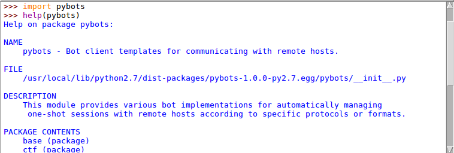
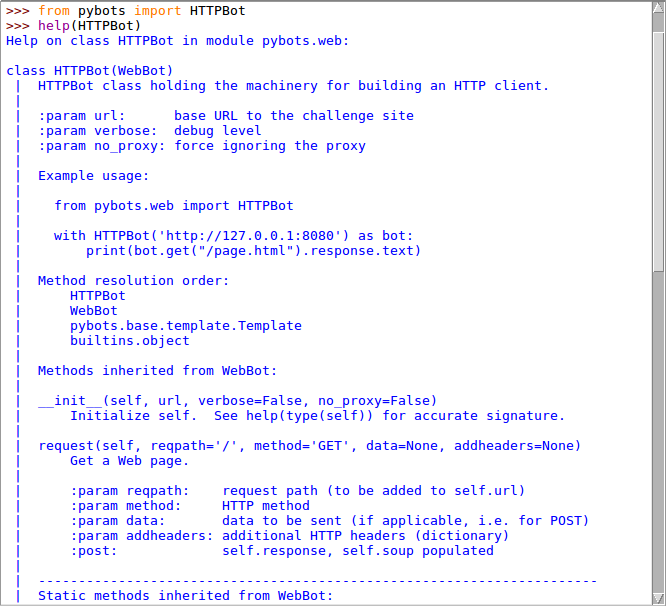

## Overview

Each bot class is implemented as a context manager and has a basically configured logger attached. It can thus be instantiated in a clear and straightforward way. Here is an example:

``` python
from pybots import Netcat

class MyBot(Netcat):
    def precompute(self):
        self.lookup_table = ...

    def preamble(self):
        self.read_until('>')

with MyBot("remote_host", 1234) as bot:
    bot.write("Hello!")
    data = bot.read_until("hash: ")
    hash = data.split("hash: ")[-1]
    hash = bot.lookup_table[hash]
    bot.write(hash)
```

Note that, if a bot is used behind a proxy, it will use system's proxy settings. This can be bypassed by using `no_proxy=True` while instantiating the bot.

``` python
with MyBot("LAN_host", 1234, no_proxy=True) as bot:
    # ...
```

-----

## Getting help

Each module is documented. Python's built-in `help` function can thus be used to get help from an interactive console.





-----

## General-purpose bots

<font size="4"><b>`SocketBot`</b></font>

This generic bot is mostly inspired from this [Gist](https://gist.github.com/leonjza/f35a7252babdf77c8421). It also handles system's proxy settings using an implementation inspired from this [recipe](http://code.activestate.com/recipes/577643-transparent-http-tunnel-for-        python-sockets-to-be-u/).


It can be instantiated using the following arguments:

**Argument** | **Default** | **Description**
--- | --- | ---
`host` |  | Hostname or IP address
`port` |  | Port number
`disp` | `False` | Display all exchanged messages
`verbose` | `False` | Verbose mode
`prefix` | `False` | Prefix messages for display (i.e. *[SRC]* for the server, *[BOT]* for the bot)
`no_proxy` | `False` | Force ignoring system proxy settings

When a SocketBot is instantiated, it only registers the input arguments as attributes and creates an empty buffer for collecting the received data. In order to initiate a communication, the `connect` method must be used. This way, the associated socket can be reconnected or connections to other remote hosts can be made with the same bot.

For communicating, the bot has four methods:

- `write`: for writing to the socket (using, by default, "\n" as the EOL character)
- `read`: for reading on the socket a given length of bytes
- `read_until`: for reading blocks until a given pattern is reached
- `send_receive`: for combining `write` then `read_until`

Each time a read/write method is used, it returns the collected data.

An example of use of the SocketBot class is the Netcat bot (see next section).


<font size="4"><b>`WebBot`</b></font>

This generic bot aims to handle an HTTP session using predefined headers and relies on the `requests` library. It holds a `_request` attribute with the `requests.Request` instance and a `response` attribute with the `requests.Response` one. It has also a method for setting a cookie.


It can be instantiated using the following arguments:

**Argument** | **Default** | **Description**
--- | --- | ---
`url` |  | URL of the website (e.g. `http://example.com`)
`verbose` | `False` | Verbose mode
`no_proxy` | `False` | Force ignoring system proxy settings

For communicating, the bot has a few methods (the first being generic and the others being particularization of the first):

- `request`: generic method for requesting resources, holding a `method` argument for defining the HTTP method to be used
- `get`, `post`, `header`, `options`, `put`, `delete`: `request` method using `method=...`

At instantiation, HTTP-related methods are dynamically bound so that `get`, `post`, `header`, `options`, `put` and `delete` become available.

-----

## Specific-purpose bots

<font size="4"><b>`Netcat`</b></font>

This bot implements a Netcat-like bot that handles a single connection with a remote host, by default executing a preamble that reads from the server up to the first newline and displays the received data.


Here is an example:

``` python
with Netcat(ip_address, port) as nc:
    nc.write("Hello !")
```

Another example, redefining the preamble, writing with a different EOL character:

``` python
class MyNetcat(Netcat):
    def preamble(self):
        self.read_until(">")

with MyNetcat(ip_address, port) as nc:
    nc.write("dir", eol="\r\n")
```

<font size="4"><b>`EPassport`</b></font>

This bot is a more specific implementation of the `Netcat` bot, especially made for working with `pypassport` (only supported with Python 2.7). It implements a reader class called `RemoteVirtualTerminal` using `pypassport.Reader` that makes the interface between the bot and the library for emulating the terminal that reads the epassport information.


`set_MRZ` and `get_photo` methods return `self` for method chaining. This allows a simple implementation like follows:

``` python
with EPassport(ip_address, port) as ep:
    ep.set_MRZ("...").get_photo("photo.jpg")
```

<font size="4"><b>`IRCBot`</b></font>

This bot aims to manage conversations on an IRC server using a `msg` method. It connects and sends user's data (by default, the nickname is `ircbot` and the full name is `IRC Bot`). It then executes the user-defined preamble and finally tries to connect to the input channel.


``` python
class MyIRCBot(IRCBot):
    def preamble(self):
        self.msg("hellosrv", "HELLO")

with MyIRCBot(ip_address, port, channel="#a_channel") as irc:
    irc.msg("all", "Hello world!")
```

<font size="4"><b>`HTTPbot`</b></font>

This bot is an inherited class of the WebBot in that it adds a parsing of the current response using [`BeautifulSoup`](https://www.crummy.com/software/BeautifulSoup/bs4/doc/), stored in a new `soup` attribute.


``` python
with HTTPBot(url) as bot:
    bot.get("/")
    print(bot.soup.prettify())
```

<font size="4"><b>`JSONBot`</b></font>

This bot is an inherited class of the WebBot in that it adds a parsing of the current response using the `json` built-in module, stored in a new `json` attribute. Also, while initializing, it automatically adds the right `Content-Type` HTTP header so that the bot communicates with JSON objects.


``` python
with JSONBot(url) as bot:
    bot.get("/")
    print(bot.json)
```

-----

## Application-related bots

<font size="4"><b>`RingZer0Bot`</b></font>

This bot realizes, using the `HTTPBot` class, the following steps for communicating with the related CTF website:

While entering bot's context:

- Set the given cookie for further communications
- Get the challenge page based on the input `cid` (Challent ID)
- Parse the challenge page for the CSRF token
- Parse the challenge page for challenge inputs (attached in the `inputs` attribute as a dictionary)
- Execute bot's logics defined by the user (the `answer` attribute must be set at the end of the computation

While exiting the context:

- Submit user's answer and get the related response (where the flag is displayed)
- Parse the response for getting the flag
- Submit the flag for earning the points


``` python
with RingZer0Bot(1, "session_cookie") as bot:
    # this binds relevant inputs for challenge #1
    # process bot.inputs
    # set the 'answer' attribute
```

<font size="4"><b>`RootMeIRCBot`</b></font>

This bot realizes, using the `IRCBot` class, the following steps for communicating with the related CTF website:

While initializing:

- Connect to `irc.root-me.org` on channel `#root-me_challenge` using the input nickname

While entering bot's context:

- Read data on the IRC channel up to a server-related pattern
- Send a server-formatted private message to Candy bot for getting the challenge input
- Parse the challenge input for making the `inputs` attribute

While leaving the context:

- Send a server-formatted private message to Candy bot with the challenge answer
- Read Candy bot's response for getting the flag and display it


``` python
with RootMeIRCBot(1, "my_rootme_username") as bot:
    # this binds relevant inputs for challenge #1 in bot.inputs['message']
    # process bot.inputs['message']
    # set the 'answer' attribute
```
